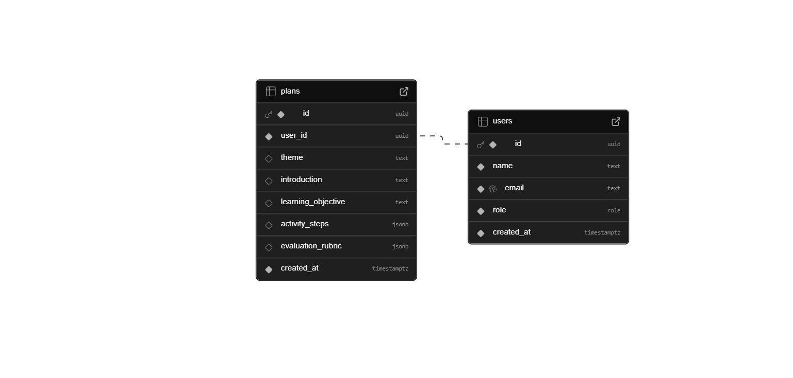

## 📚 Sumário

- [🧠 Decisões Técnicas](#-decisões-técnicas)
  - [💾 Banco de dados: Supabase](#-banco-de-dados-supabase)
  - [🤖 IA: Gemini API (Flash 2.5)](#-ia-gemini-api-flash-25)
  - [🧠 Linguagem: TypeScript](#-linguagem-typescript)
  - [⚡ Next.js](#-nextjs)
  - [🌐 Fetch API](#-fetch-api)
  - [📦 Gerenciador de Pacotes: Yarn v1](#-gerenciador-de-pacotes-yarn-v1)
  - [🗄️ Schema do Banco de Dados](#️-schema-do-banco-de-dados)
  - [🗄️ Código SQL](#️-código-sql)


# 🧠 Decisões Técnicas

## 💾 Banco de dados: Supabase

**✅ Escolhido: Supabase**
O Supabase foi escolhido como backend principal e banco de dados por já ser definido no escopo do teste técnico.
Além disso, ele oferece um ecossistema completo — PostgreSQL gerenciado, autenticação pronta, armazenamento de dados e API REST gerada automaticamente — o que acelera a implementação e reduz a complexidade da infraestrutura.

> 📦 Com o uso da Supabase CLI, foi possível inicializar o ambiente local, gerenciar schemas do banco e sincronizar dados com o ambiente em nuvem de forma simples e segura.

----------

## 🤖 IA: Gemini API (Flash 2.5)

**✅ Escolhido: Gemini API**
A integração com a Gemini API (modelo Flash 2.5) foi escolhida para gerar planos de aula personalizados a partir das informações fornecidas pelo usuário.
A escolha desse modelo se deu pelo equilíbrio entre velocidade de resposta, baixo custo operacional e boa compreensão contextual, permitindo gerar resultados coerentes sem comprometer o tempo de execução da aplicação.

>💡 O modelo foi configurado para receber prompts detalhados e retornar um texto estruturado, seguindo o formato de um plano de aula com seções definidas (objetivos, metodologia, avaliação etc.).

----------

## 🧠 Linguagem: TypeScript

**✅ Escolhido: TypeScript**
O TypeScript foi adotado tanto no frontend quanto no backend por garantir tipagem estática, maior previsibilidade do código e melhor integração com ferramentas modernas.
Essa escolha reduz erros em tempo de execução e facilita a manutenção a longo prazo, especialmente em um projeto que envolve consumo de API e manipulação de dados dinâmicos.

----------

## ⚡ Next.js

**✅ Escolhido: Next.js**
O Next.js foi escolhido para o frontend por sua arquitetura robusta e flexível, permitindo a construção de uma interface moderna e responsiva com renderização híbrida (SSR e CSR), rotas otimizadas e melhor desempenho em produção.
A integração com TypeScript e Tailwind CSS torna o desenvolvimento mais ágil e escalável.
>🚀 Além disso, o Next.js oferece excelente suporte para deploys rápidos e integração contínua com plataformas como Vercel.

----------

## 🌐 Fetch API

**✅ Escolhido: Fetch API**
A Fetch API foi utilizada para o consumo de dados entre o frontend (Next.js) e o backend (Supabase/Gemini).
Essa abordagem nativa simplifica o código e elimina a necessidade de dependências externas como Axios, mantendo a aplicação leve e direta ao ponto.

----------

## 📦 Gerenciador de Pacotes: Yarn v1

**✅ Escolhido: Yarn 1.22.x**
-   Lockfile mais estável que o NPM
-   Boa performance no uso local

----------

## 🗄️ Schema do Banco de Dados



*Descrição:*
O schema representa as principais tabelas do sistema, seus atributos e relacionamentos, como:
- Usuários
- Planos

## 🗄️ Código SQL

```
CREATE TYPE role AS ENUM ('TEACHER', 'ADMIN');

CREATE TABLE public.users (
  id uuid PRIMARY KEY DEFAULT gen_random_uuid(),
  name text NOT NULL,
  email text NOT NULL UNIQUE,
  role role NOT NULL DEFAULT 'TEACHER',
  created_at timestamp with time zone NOT NULL DEFAULT now()
);

CREATE TABLE public.plans (
  id uuid PRIMARY KEY DEFAULT gen_random_uuid(),
  user_id uuid NOT NULL,
  theme text,
  introduction text,
  learning_objective text,
  activity_steps jsonb DEFAULT '[]'::jsonb,
  evaluation_rubric jsonb DEFAULT '[]'::jsonb,
  created_at timestamp with time zone NOT NULL DEFAULT now(),
  CONSTRAINT plans_user_id_fkey FOREIGN KEY (user_id) REFERENCES public.users (id)
);

```
